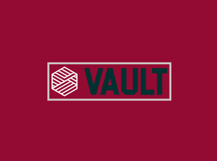

# Vault 

Free and open source tool to self host your secrets manager


# Why use a secrets manager
Well all of us have env fatigure needing to configure multiple secrets in multiple secrets in multiple services and it becomes a hassle

With this the only env a service needs is a client key and the url for the manager 


# Usage 

## default credentials for login 

{
"username": "admin",
"password": "password"
}

Note you should set the x-skip-auth header to true 


full reqeust 

```zsh
curl http://localhost:3000/auth/login \
  --request POST \
  --header 'X-Skip-Auth: true' \
  --header 'Content-Type: application/json' \
  --data '{
  "username": "admin",
  "password": "password"
}'

```


## Env 
Look at the env for more details

## Endpoints 

you cann download the openapi def from {url}/swagger
